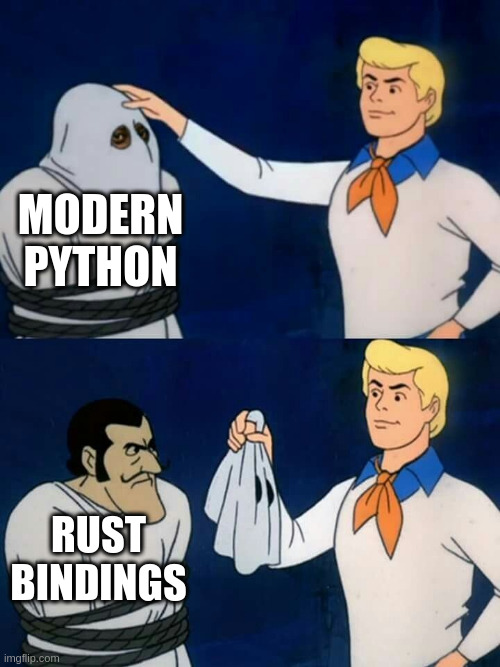

# Materials for today

Clone this repo: `github.com/ber2/meteo-agent`

```bash
gh repo clone ber2/meteo-agent
```

<!-- end_slide -->
# About me

<!-- column_layout: [1, 1] -->
<!-- column: 0 -->


<!-- column: 1 -->

**ber2.github.io**

**github.com/ber2**

- PhD in Maths
- Worked in Data for >10 years
- Currently working as a **Data Freelancer**
- Meetup organiser at **Python Barcelona**
- Also a **Data Analysis** and **Computer Science** teacher


<!-- end_slide -->

# Initial motivation

Fact:

> Due to the arrival of **LLMs** and **coding agents**,
> the approach to coding has changed dramatically in recent years.

<!-- pause -->

Soon, all coding will be delegated to agents and, therefore, getting code to work will be a trivial task.

In consequence, the knowledge that software engineers have accumulated over the last few decades on what makes software work and what not will become irrelevant.

<!-- pause -->

**Do you agree?**

<!-- pause -->

**On the contrary**: agents are great speed multipliers but, if we are to hope to get reliable software out of them, we'd better pay attention to good practices. 

<!-- end_slide -->

# Goal for today

1. **We learn by doing**: we will build an AI agent from scratch. Also: we will demistify the concept.

2. We will use **software engineering best practices** when building the above.

<!-- pause -->

Amongst other things, **production-grade code** should be: typed, tested, observable, reproducible, maintainable.

<!-- end_slide -->

# Know your audience

Raise your hand if you...

<!-- pause -->
- have previous experience with **Python**
<!-- pause -->
- are a frequent **Python user**
<!-- pause -->
  - know what happens if you `import this`
<!-- pause -->
- know what **`uv`** is and have used it
<!-- pause -->
- 
<!-- pause -->
- regularly use an **AI assistant** for your coding tasks:
  - IDE integrations: Github Copilot, Cursor, etc
<!-- pause -->
  - CLI tools: Claude Code, Gemini CLI, Cline, etc  
<!-- pause -->
- are comfortable running **Docker** containers
<!-- pause -->
- have shipped an **AI agent to production**
 
<!-- pause -->
## On access to LLMs

Raise your hand if you:
<!-- pause -->
- Have an API token for an LLM provider:
<!-- pause -->
  - Google AI (Gemini via AI Studio or Vertex AI)
<!-- pause -->
  - OpenAI API (GPT)
<!-- pause -->
  - Anthropic API (Haiku, Sonnet, Opus)
<!-- pause -->
- Are capable of running LLMs locally via `Ollama`.
<!-- pause -->
- Any other means of interacting with LLMs?


<!-- end_slide -->


# First, some definitions

<!-- column_layout: [1, 1] -->

<!-- column: 0 -->
## An LLM

A function that predicts the **next token**.

`P(next | context)`

That's it. No memory. No actions. No goals.\
No thinking.
<!-- pause -->

<!-- column: 1 -->
## An agent (from RL)

An entity that **observes** an environment, takes **actions**, and optimizes a
**reward**.

sense -> act -> result -> sense -> ...

<!-- reset_layout -->

<!-- pause -->

## So what is an *AI agent*?

**LLM (the policy) + tools (the actions) + a loop (observe results, act again).**

The LLM proposes tool calls; tools touch the world; results feed back.\
The reward is implicit (did we answer?); the **loop is explicit**.

<!-- end_slide -->

# What we build: a natural language analyst

I have prepared a sqlite database containing weather observations from a station in **La Beguda**:

- **~700k** readings
- **2002 -> today**

The point is to be able to ask questions and get the agent to use the SQL data to answer.

```
> What is the hottest day on record?
  -> get_schema()
  -> run_sql("SELECT date, temperature_max FROM meteobeguda_daily
              ORDER BY temperature_max DESC LIMIT 1")
The hottest day on record was 2010-08-16, at 40.6 °C.
```

The answers that we obtain are grounded in the available data.

<!-- end_slide -->

# The plan (5 hours)

- `0:00`  Setup, definitions, the stack
- `0:30`  Part 1 — the agent loop FROM SCRATCH (no framework)
- `1:30`  break + exercise
- `2:00`  Part 2 — rebuild in LangGraph; when is a framework worth it?
- `3:00`  Part 3 — MCP: standardize your tools
- `4:00`  Testing non-deterministic code
- `4:30`  Observability + evals with Langfuse

Live coding, with a git checkpoint per module so we can always catch up.

<!-- end_slide -->

# Aside: modern Python is Rust in a trench coat

<!-- column_layout: [1, 1] -->
<!-- column: 0 -->
There is a trend in recent year where a lot of _modern_ Python tools and libraries are Python on the outside and **Rust** on the inside.

- **`uv`** — installer/resolver (Rust)
- **`pydantic`** — `pydantic-core` (Rust)
- **`ruff`** — linter/formatter (Rust)
- **`ty`** — type checker/LSP (Rust)
- **`polars`, `tiktoken`** — (Rust)

We get to write easy Python while obtaining Rust-level performance. That's why.
<!-- column: 1 -->



<!-- end_slide -->

# The promise

You should be able to take this workshop away and repeat it at home for free.\
Without giving your money or personal data away.

We favour open LLMs and open-source services that you can run locally.

<!-- pause -->

# The harsh reality

Token poverty is real.

<!-- pause -->
It is hard to get results without:
- paying a third-party to use their closed LLM
<!-- pause -->
- paying a third-party for their GPU
<!-- pause -->
- access to a GPU

<!-- reset_layout -->

<!-- end_slide -->

# The stack, and what we said no to

| We use            | Instead of            | Because                                  |
|-------------------|-----------------------|------------------------------------------|
| `uv`              | pip / poetry / conda  | fast, reproducible, one tool             |
| `pydantic`        | dataclasses / typed dict / manual  | validation + JSON schema for tools       |
| Model-agnostic frameworks | provider SDKs         | the LLM should be a _commodity_                |
| LangGraph         | raw / CrewAI / Strands / Pydantic AI | design choice       |
| MCP               | CLIs / ad hoc integrations  | setting a standard |
| Langfuse          | LangSmith             | open-source, self-hostable |

<!-- end_slide -->

# Model agnosticity 

There are many reasons not to get married to a single LLM provider.

Our code should depend as little as possible on the choice of LLM.

Frameworks like **LangGraph** or **Pydantic AI** in part act as an intermediate layer handling LLM integration; that's one of their big selling points.

<!-- pause -->

Underneath, most providers expose APIs that are **OpenAI-compatible**.

Swapping providers is an env change, not a code change.

```bash
# free, local, fast on CPU, sufficient for today
OPENAI_BASE_URL=http://localhost:11434/v1    MODEL=qwen2.5:2b
# still free, local, slightly slower, better results
OPENAI_BASE_URL=http://localhost:11434/v1    MODEL=qwen2.5:7b

# bigger, hosted, 
OPENAI_BASE_URL=http://localhost:11434/v1    MODEL=qwen2.5:cloud

# someone else's cloud
OPENAI_BASE_URL=https://api.openai.com/v1        MODEL=gpt-4o-mini
OPENAI_BASE_URL=https://api.anthropic.com/v1/    MODEL=claude-opus-4-8
```

Today we run on **ollama** by default

<!-- end_slide -->

# Part 1 — the loop, by hand

An "agent" is a `while` loop. No magic.

```python
while step < MAX_STEPS:
    response = client.chat.completions.create(
        model=model, messages=messages, tools=OPENAI_TOOLS)
    message = response.choices[0].message
    messages.append(assistant_message(message))

    if not message.tool_calls:        # model is done
        return message.content

    for call in message.tool_calls:   # do the work, feed it back
        result = dispatch_tool(call.function.name,
                               json.loads(call.function.arguments))
        messages.append({"role": "tool",
                         "tool_call_id": call.id, "content": result})
```

Typed tools. Read-only SQL. Errors fed back so the model self-corrects.

<!-- end_slide -->

# Part 2 — LangGraph: when is a framework worth it?

Same tools, now a graph. The loop becomes two nodes and an edge.

```python
graph = StateGraph(MessagesState)
graph.add_node("model", call_model)
graph.add_node("tools", ToolNode(LANGCHAIN_TOOLS))
graph.add_edge(START, "model")
graph.add_conditional_edges("model", tools_condition)
graph.add_edge("tools", "model")
```

We **reuse the exact same `run_sql`** — a refactor, not a rewrite.

> Now you can answer "is the framework worth it?" — because you felt its
> absence an hour ago.

<!-- end_slide -->

# Part 3 — MCP: stop reinventing tool plumbing

A tool server, in a few lines, wrapping the **same** function:

```python
mcp = FastMCP("meteobeguda")

@mcp.tool(description="Run a single read-only SQL SELECT query.")
def run_sql(query: str) -> str:
    return _run_sql(query)
```

The agent connects over the protocol:

```python
client = MultiServerMCPClient({"meteobeguda": {
    "command": "uv", "args": ["run", "meteo-mcp"], "transport": "stdio"}})
tools = await client.get_tools()
```

One protocol, any client, any language. 

Caveat: prefer maintained servers — the official SQLite one is archived.

<!-- end_slide -->

# Testing non-deterministic code

You can't assert on an LLM. You **can** assert on everything around it.

```
        /  Langfuse evals    \     quality, over a dataset (graded)
       /  integration test    \    real ollama + Langfuse (opt-in)
      /   recorded fixture     \   the loop, scripted client, 0 live calls
     /      unit tests          \  pure logic: SQL guard, rendering
```

```python
def test_ensure_read_only_blocks_writes(query):
    with pytest.raises(ValueError):
        ensure_read_only("DROP TABLE meteobeguda_events")
```

**Goal** is to get to `pytest` green with **no network**.

Integration (slow) runs behind `-m integration`.

<!-- end_slide -->

# Observability + evals with Langfuse

One callback turns the agent into a traced, costed, inspectable system:

```python
run_agent(question, config={"callbacks": [langfuse_handler()]})
```

Evals as a reproducible experiment, scored against **ground truth from the DB**:

```python
client.run_experiment(name="meteo-canonical-questions",
                      data=local_dataset(), task=task,
                      evaluators=[contains_reference])
```

Self-hosted. Your traces never leave your laptop.

<!-- end_slide -->

# It's all free, and it's all yours

```bash
docker compose up -d                       # Langfuse, self-hosted
docker compose --profile with-ollama up -d # + a local LLM
uv run python data/build_db.py             # the dataset
uv run meteo-graph "How many days hit 35 C in 2023?"
```

No paid API. No SaaS lock-in. SQLite + ollama + Langfuse + uv.

A participant can run **the entire workshop** on their own machine.

<!-- end_slide -->

# Next steps to production

- Pin models; treat prompts as versioned artifacts
- Retries, timeouts, fallbacks at every API boundary
- Sandbox tools; assume prompt injection
- Track cost and latency budgets, not just correctness
- Keep the eval set growing from real failures

<!-- end_slide -->

# Thank you

Questions — and let's go break things; **it's hacking time**.

